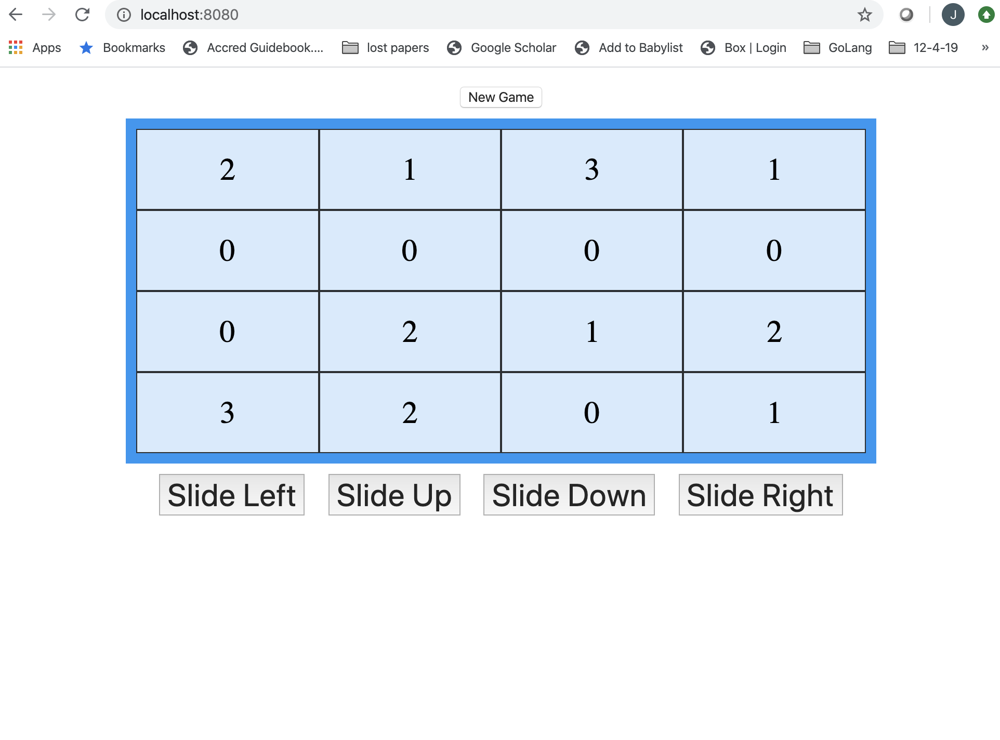

# Kattis 2048 Variation

## Description
This project is a variation of the 2048 problem from [Kattis](https://open.kattis.com/problems/2048).

This variation is puzzle game where a player slide tiles across a 4 x 4 grid with the goal of reducing the number of tiles as much as possible.  The player can slide Up, Down, Right, and Left. When tiles collide that have the same value, they will combine into a sigle tile with the value of the sum of the collided tiles. Zeros are not counted and are treated as blank tiles.




## Installation

If the environment where this project is to be run does not already have Golang installed, the simplest way to run it is to download and install Docker and then pull the image.

To install docker follow the appropriate link for your OS -- [Mac](https://docs.docker.com/docker-for-mac/install/), [Linux](https://docs.docker.com/install/linux/docker-ce/ubuntu/), [Windows](https://docs.docker.com/docker-for-windows/install/)

Once Docker is installed, test it is working appropriatly by running the following:

```bash
$ docker run hello-world

Hello from Docker.
This message shows that your installation appears to be working correctly.
...
```

Next, pull the image from dockerhub:

```
$ docker pull jakers85/goprojects:puzzlegame
```

Verify the the image was pulled by running:

```
$ docker images | grep puzzlegame
```

## Usage/ How to Run

To run the Docker image and start the program use the following command:

```
$ docker run -p8080:8080 --rm jakers85/goprojects:puzzlegame
```

This will start the server.

Now open a web browser and navigate to:

[http://localhost:8080](http://localhost:8080)

Enjoy!

To exit the program, return to the command propt and enter ctrl+c
